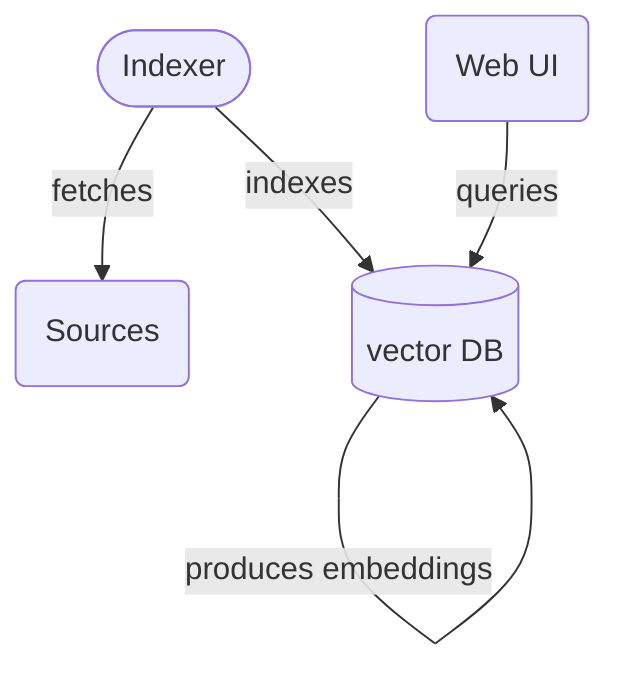

# Kilimandjaro

Kilimandjaro is a program that provides mapping from any labels to medical terminologies.

<SCREENSHOT FROM THE WEB UI>

Currently two sources are used:
  - the french Snomed CT
  - the CCAM terminology

In order to provide a useful mapping, we compare text [embeddings](https://huggingface.co/blog/getting-started-with-embeddings).

The main way to use Kilimandjaro is to:
1. produce and store embeddings
2. query through the UI.

We use `uv` to manage dependencies and run programs.

To produce the embeddings - here for the CCAM data source:

```shell
uv run src/kilimandjaro/indexer.py add ccam
```

It will fetch the source data, produce and store the embeddings in a local [ChromaDB](https://www.trychroma.com) instance.

For this source, the whole process is several minutes long.

Then launch the web UI:

```shell
uv run streamlit run src/kilimandjaro/main.py
```

## Architecture

The three main pieces of this application are:
  - the vector database, using ChromaDB, to produce and store embeddings
  - the indexer program, which fetch source data and push them to ChromaDB
  - the web UI, which allows humans to really use the application


The indexer is a command line. This:

```shell
uv run src/kilimandjaro/indexer.py
```

will display available commands.

It currently fetches data from a triple store.

## Configuration

To be able to fetch data, you must provide a triple store endpoint in the corresponding configuration section:

```toml
[kilimandjaro.sources]
triple-store-url = "<ENDPOINT URL>"
```

## Notes

### CCAM

- when parsing the JSON payload outside with `rye run indexer add ccam | yq` some errors appears
 - for example for this acte: `{'code':'MBFA001', 'label': 'Résection "en bloc" d\'une extrémité et/ou de la diaphyse de l\'humérus'}`
 - this would be a better encoding: `"label":"Résection \"en bloc\" d\\'une extrémité et/ou de la diaphyse de l\\'humérus"`?
